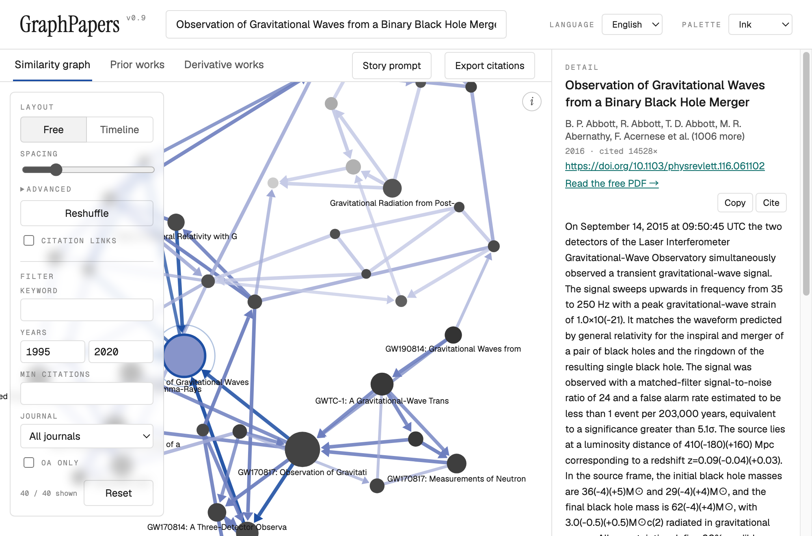

<picture>
  <source media="(prefers-color-scheme: dark)" srcset="docs/hero-dark.png">
  
</picture>

Built around the 2016 detection of GW150914. Live data, as the app always shows it.
(The dark capture is one release behind — OpenAlex's daily request quota ran out before it could be retaken.)

# GraphPapers

**v0.8** · [Open it in a browser](https://oddthumb.github.io/GraphPapers/)

A free, single-file alternative to Connected Papers. Enter a paper, get a
force-directed graph of the ~40 works most related to it, then export a ready-made
prompt that turns that graph into a narrative history — in your own LLM, at no cost.

No install. No account. No API key. No backend. One HTML file.
Works on a phone as well as a desktop — the layout rearranges itself rather than shrinking.

---

## Running it

Open it at **https://oddthumb.github.io/GraphPapers/**, or download `index.html`
and double-click it. Either way works, and both are the whole procedure.

Everything the app needs to run is inside that file, including the d3 graph library.
The only thing it fetches from the network is the paper data itself, live from
[OpenAlex](https://openalex.org) — a free, open catalogue of 250M+ works that needs
no key and imposes no cost.

Sharing it means sending a link, or one file. Either way the recipient is working immediately.

---

## What it does

### Similarity graph

Enter a title, DOI, or OpenAlex ID. The app pulls the seed paper's references and
the works citing it, then scores every candidate against the seed using the same
two measures Connected Papers uses:

- **Bibliographic coupling** — two papers that cite many of the same works are
  probably about the same thing.
- **Co-citation** — two papers that are frequently cited together are probably
  about the same thing.

Both measures are standard bibliometrics, not anyone's proprietary method — bibliographic
coupling is Kessler (1963), co-citation is Small (1973).

The 40 highest-scoring papers become the graph. Each node connects to its three
nearest neighbours, so clusters emerge on their own.

**An edge means similarity, not citation.** Two papers are joined because they cite
the same works or are cited together — they need not cite each other at all. Where a
real citation does exist between two joined papers, the edge carries an arrowhead
pointing at the older work. To see citations on their own terms, tick **Citation links**:
that overlays every real citation between the papers on screen, on top of the
similarity layout, without moving anything.

| Encoding | Meaning |
|---|---|
| Node size | Citation count |
| Node colour | Publication year — pale (older) to dark (newer) |
| Accent ring | The seed paper |
| Edge weight | Similarity between the two papers |
| Edge colour | Distance from the seed — the accent, fading with each hop |

Everything that changes the graph lives in one panel at its top-left; everything that
only reads from it — **Story prompt**, **Export citations** — stays in the tab bar. The
**i** button at the top-right opens the full legend.

Drag nodes, scroll to zoom, and use the **Spacing** slider to loosen or tighten the
layout, or open **Advanced** for the four forces underneath it — link distance, pull,
push and collision gap, each slider centred on the value the layout was tuned to.
**Reshuffle** throws the nodes to new starting positions and lets the layout
settle again — a force layout falls into whichever arrangement its start positions
lead to, so a tangled graph often untangles on the second try. **Timeline** stacks the
papers by year instead, oldest at the top, so citation arrows all point upward into
the past; each year that actually occurs gets an equal band, so a single old reference
cannot squash the recent decade into a sliver. Three colour palettes sit in the header.

Click a node to pin its neighbourhood; click empty canvas to release it. Click any node to see its abstract, authors, and DOI — and to rebuild the
whole graph around it.

### Prior and derivative works

Two tabs beside the graph list what the seed paper cites and what cites it, ranked
by citation count.

### Quantum Jump

Following citations keeps you inside one conversation. **Quantum Jump!** leaves it: it
moves the graph to a paper that has *no citation link* to the current one, and draws a
trail back to where you came from, so the path stays visible however far you wander.

Two ways of finding those papers, chosen with **Find by**:

| | It looks for | It cannot see |
|---|---|---|
| **Read together** | Papers other researchers cite alongside this one, though the two never cite each other | Papers too recent for anyone to have cited them yet |
| **Shared foundations** | Papers that cite the same *rare* works this one cites | Work built on a different literature |
| **Same ideas** | Papers tagged with subjects you choose, and no bibliometric tie at all | Work OpenAlex has tagged differently |
| **Linked through a third paper** | Papers with no link to yours, both strongly tied to some intermediate — Swanson's 1986 method, which connected fish oil to Raynaud's disease through blood viscosity | Pairs with no intermediate in common |

**Same ideas** hands you the seed's own subject tags and lets you pick which to combine.
The choice decides the reach: keeping the object terms holds you inside the field, while
picking a measurement term — *spectral analysis*, say — reaches work in medicine or
engineering doing the same kind of analysis. OpenAlex does not mark which tags are which,
and only the person reading knows which axis matters.

The four routes returned no overlapping candidates at all in testing, on either seed.

Rarity is what makes the second one work. Sharing a field's standard catalogue with
someone is no evidence of anything; sharing a paper cited eight times means you are
looking at nearly the same problem.

Both are corrected for fame — a raw count of shared citations just returns whichever
papers everyone cites. Both drop candidates already drawn, so pressing the button again
gives you somewhere new; **Undo jump** steps back, and **Reset draws** starts over.
**Field** narrows the search to the same discipline, or restricts it to a different one.

Hover the trail to see why two papers were linked: the works that cite them both, or the
references they share.

### Citation export

**Export citations** writes the papers out as BibTeX, RIS, APA, MLA, or Chicago —
one paper, everything the filters currently show, or all 40. Copy it, or download a
`.bib` / `.ris` file and drag it straight into Zotero, EndNote, or Overleaf.

Author names come from OpenAlex as single strings, so the family name is taken as
everything after the last space. That is right for most Western names and wrong for
some; check the names before submitting.

### Filtering

In the same left-hand panel: keyword (title and authors), year range, minimum
citations, open access, and journal impact. The journal filter uses OpenAlex's 2-year mean citedness, ranked among the
journals present in the current graph — it is **not** a JCR quartile, which is not
open data. Filtering hides papers without moving the layout, and resets whenever you
build a new graph.

### LLM story prompt

The **Story prompt** button assembles a prompt describing the graph — every paper
grouped as prior, later, or related, with its year, first author, citation count,
and distance from the centre in graph hops.

Copy it into ChatGPT, Claude, Gemini, or anything else, and you get a written
history of the research line: what problem the centre paper solved, what led to it,
and what it produced.

| Depth | Papers | Use it for |
|---|---|---|
| 1 | ~10 | A tight story about the paper's immediate neighbourhood |
| 2 | ~25 | The default — enough context to see a lineage |
| 3 | ~37 | The whole field around the paper |
| All | 39 | Everything in the graph |

Output language is switchable between English and Korean.

The app builds this text itself — it never calls an LLM, so this step costs nothing,
needs no key, and works instantly. Which model reads it is entirely your choice.

---

## Data freshness

There is no local cache and no database. Every lookup goes straight to OpenAlex, so
what you see is what OpenAlex holds at that moment. The bottom-right corner always
shows the time of the current fetch and the date OpenAlex last updated the seed
record, so you know exactly what you are looking at.

The cost of that guarantee is that **the app needs an internet connection**. Without
one it opens and renders, but cannot fetch papers, and says so.

OpenAlex allows 1,000 requests a day, counted per IP address — your own, not shared with
anyone else using GraphPapers. A graph costs four to eight requests and a Quantum Jump one
to six, so the ceiling is somewhere above a hundred graphs a day and most people will never
approach it. The bottom-right corner shows what you have left and when it resets, and turns
the accent colour as it runs low, so the limit is visible before it is reached rather than
arriving as an unexplained failure.

---

## Requirements

A modern browser. That is all.

### On a phone

The layout rearranges below 760px rather than scaling down. The graph and the detail
panel stop sitting side by side and the panel becomes a sheet that slides up when you
tap a node, since a strip under a full-height graph cannot be read and cannot be
scrolled to — dragging over the canvas pans the graph. The control panel folds behind a
button so it does not cover what it controls, and the header wraps to give the search
box a full row. Pinch to zoom and drag nodes work on touch.

Google Fonts is the only other external reference; if it is unreachable the app
falls back to system fonts and works normally.

---

## Credits

Sangin Kim — <kimsanginn@gmail.com>  
Sehwan Cheon — <thousandsh2@gmail.com>

Ideas, bug reports, and pull requests are welcome; contributors are credited in the
app, under the Acknowledgements link in the bottom-right corner.

Paper data from [OpenAlex](https://openalex.org). Graph layout by
[d3](https://d3js.org).

Licensed under the [MIT License](LICENSE). Free to use, modify, and sell, provided
the copyright notice is kept.

Still 0.x: the shape of this changes often. 1.0 is reserved for when it has been used on
a real manuscript and earned the right to stop moving.

GraphPapers is an independent project. It is not affiliated with, endorsed by, or
derived from the code or design of Connected Papers; the comparison in this document
is descriptive only.
